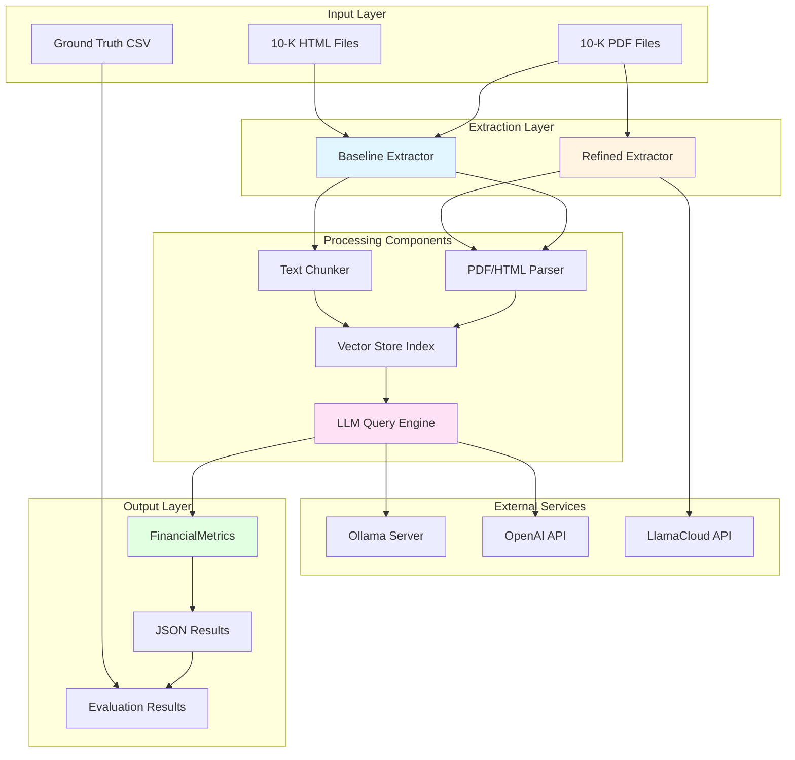
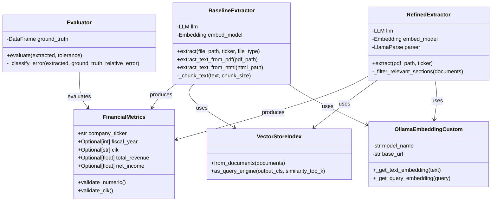
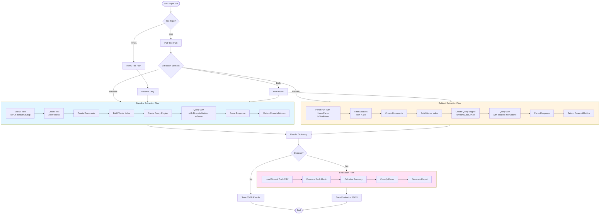
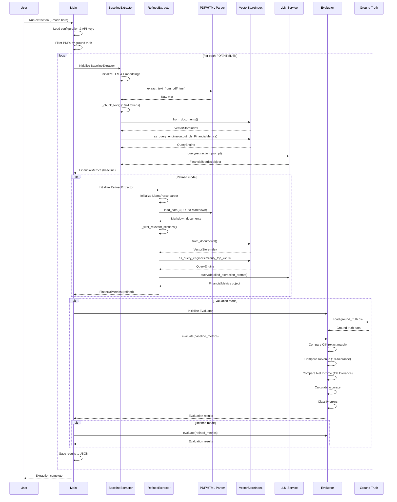
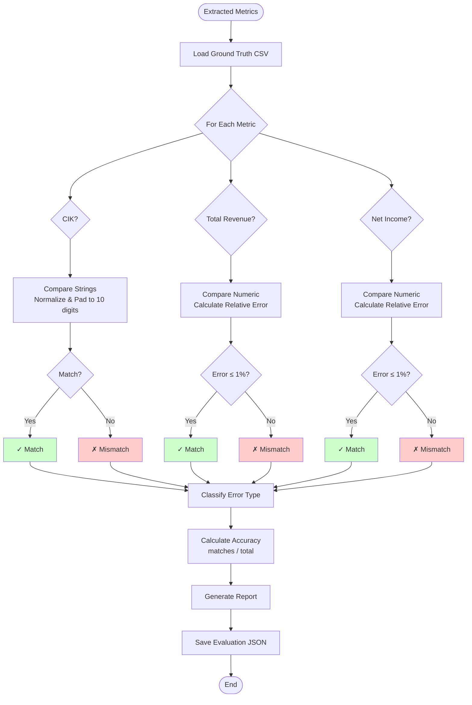
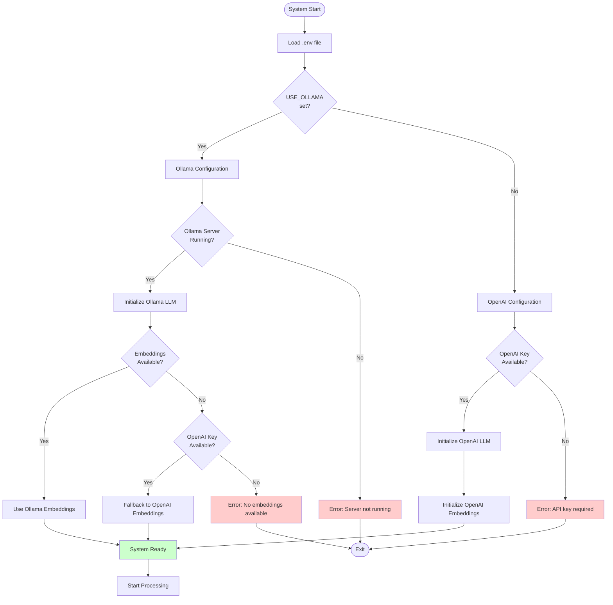

# 10-K Financial Data Extraction System - Architecture & Flow Diagrams

## Table of Contents
1. [System Architecture Overview](#system-architecture-overview)
2. [Component Architecture](#component-architecture)
3. [Data Flow Diagram](#data-flow-diagram)
4. [State Diagram](#state-diagram)
5. [Sequence Diagram](#sequence-diagram)
6. [Extraction Pipeline Flow](#extraction-pipeline-flow)

---

## System Architecture Overview



---

## Component Architecture



---

## Data Flow Diagram



---

## State Diagram

```mermaid
stateDiagram-v2
    [*] --> Initialized: System Start
    
    Initialized --> Configuring: Load Environment
    Configuring --> ConfigCheck{API Keys<br/>Available?}
    
    ConfigCheck -->|OpenAI| OpenAIReady: OpenAI Config
    ConfigCheck -->|Ollama| OllamaReady: Ollama Config
    ConfigCheck -->|Both| BothReady: Both Available
    
    OpenAIReady --> ModelInit: Initialize Models
    OllamaReady --> ModelInit: Initialize Models
    BothReady --> ModelInit: Initialize Models
    
    ModelInit --> LLMReady: LLM Initialized
    ModelInit --> EmbedReady: Embeddings Initialized
    
    LLMReady --> ExtractorReady: Extractors Ready
    EmbedReady --> ExtractorReady: Extractors Ready
    
    ExtractorReady --> Processing: Start Processing
    
    state Processing {
        [*] --> FileLoaded: Load Input File
        FileLoaded --> TextExtracted: Extract Text
        TextExtracted --> Chunked: Chunk Text
        Chunked --> Indexed: Build Vector Index
        Indexed --> Querying: Query LLM
        Querying --> Parsed: Parse Response
        Parsed --> [*]: Metrics Extracted
    }
    
    Processing --> Evaluating: Evaluation Mode
    Processing --> Completed: No Evaluation
    
    Evaluating --> Comparing: Compare with Ground Truth
    Comparing --> Calculating: Calculate Accuracy
    Calculating --> Classifying: Classify Errors
    Classifying --> Completed: Evaluation Done
    
    Completed --> [*]: Save Results
    
    note right of ConfigCheck
        Checks for:
        - OPENAI_API_KEY
        - LLAMA_CLOUD_API_KEY
        - USE_OLLAMA flag
        - Ollama server status
    end note
    
    note right of Processing
        Can process:
        - PDF files (both methods)
        - HTML files (baseline only)
    end note
```

---

## Sequence Diagram



---

## Extraction Pipeline Flow

### Baseline Extraction Pipeline

```mermaid
graph LR
    subgraph "Input"
        A[PDF/HTML File]
    end
    
    subgraph "Text Extraction"
        B[PyPDF/BeautifulSoup]
        C[Raw Text]
    end
    
    subgraph "Text Processing"
        D[Chunk Text<br/>1024 tokens]
        E[Text Chunks]
    end
    
    subgraph "Vectorization"
        F[Create Documents]
        G[Generate Embeddings]
        H[Vector Store Index]
    end
    
    subgraph "Query & Extraction"
        I[Query Engine<br/>similarity_top_k=5]
        J[LLM Query<br/>with FinancialMetrics schema]
        K[Structured Response]
    end
    
    subgraph "Output"
        L[FinancialMetrics Object]
    end
    
    A --> B
    B --> C
    C --> D
    D --> E
    E --> F
    F --> G
    G --> H
    H --> I
    I --> J
    J --> K
    K --> L
    
    style A fill:#ffcccc
    style L fill:#ccffcc
    style J fill:#ccccff
```



### Refined Extraction Pipeline

```mermaid
graph LR
    subgraph "Input"
        A[PDF File]
    end
    
    subgraph "Advanced Parsing"
        B[LlamaParse]
        C[Markdown Documents<br/>preserves tables]
    end
    
    subgraph "Section Filtering"
        D[Filter Item 7 & 8]
        E[Relevant Documents]
    end
    
    subgraph "Vectorization"
        F[Create Documents]
        G[Generate Embeddings]
        H[Vector Store Index]
    end
    
    subgraph "Query & Extraction"
        I[Query Engine<br/>similarity_top_k=10]
        J[LLM Query<br/>table-aware instructions]
        K[Structured Response]
    end
    
    subgraph "Output"
        L[FinancialMetrics Object]
    end
    
    A --> B
    B --> C
    C --> D
    D --> E
    E --> F
    F --> G
    G --> H
    H --> I
    I --> J
    J --> K
    K --> L
    
    style A fill:#ffcccc
    style L fill:#ccffcc
    style J fill:#ccccff
    style C fill:#ffffcc
```



---

## Evaluation Flow



---

## Key Components Description

### 1. **FinancialMetrics (Pydantic Model)**
- **Purpose**: Structured data model for extracted financial metrics
- **Fields**:
  - `company_ticker`: Company stock symbol
  - `fiscal_year`: Fiscal year of the report
  - `cik`: Central Index Key (10-digit identifier)
  - `total_revenue`: Total revenue in millions USD
  - `net_income`: Net income in millions USD
- **Validation**: Automatic type conversion and CIK formatting

### 2. **BaselineExtractor**
- **Approach**: Naive text chunking
- **Text Extraction**: PyPDF (PDF) or BeautifulSoup (HTML)
- **Chunking**: 1024-token chunks
- **Vector Search**: similarity_top_k=5
- **Limitation**: Loses table structure

### 3. **RefinedExtractor**
- **Approach**: Table-preserving Markdown parsing
- **Text Extraction**: LlamaParse (PDF to Markdown)
- **Section Filtering**: Focuses on Item 7 & 8
- **Vector Search**: similarity_top_k=10
- **Advantage**: Maintains table row-column relationships

### 4. **Evaluator**
- **Purpose**: Compare extracted metrics with ground truth
- **CIK Comparison**: Exact string match (normalized to 10 digits)
- **Numeric Comparison**: Relative error ≤ 1% tolerance
- **Error Classification**: None, Minor, Moderate, Major
- **Output**: Accuracy percentage and detailed metrics

### 5. **Model Configuration**
- **OpenAI**: GPT-4o for LLM, OpenAI embeddings
- **Ollama**: Local LLM server (gpt-oss:20b), custom embeddings (nomic-embed-text)
- **Fallback**: Automatic fallback if primary service unavailable

---

## Data Structures

### FinancialMetrics Schema
```json
{
  "company_ticker": "AAPL",
  "fiscal_year": 2024,
  "cik": "0000320193",
  "total_revenue": 383285.0,
  "net_income": 96995.0
}
```

### Evaluation Results Schema
```json
{
  "ticker": "AAPL",
  "metrics": {
    "cik": {
      "extracted": "0000320193",
      "ground_truth": "0000320193",
      "match": true,
      "error_type": "None (exact match)"
    },
    "total_revenue": {
      "extracted": 383285.0,
      "ground_truth": 383285.0,
      "match": true,
      "absolute_error": 0.0,
      "relative_error": 0.0,
      "error_type": "None (within tolerance)"
    }
  },
  "accuracy": 1.0
}
```

---

## Configuration Flow



---

## Notes

1. **Dual Extraction Methods**: The system supports both baseline (simple) and refined (advanced) extraction methods for comparison.

2. **Flexible Input**: Supports both PDF and HTML files, though refined extraction (LlamaParse) only works with PDFs.

3. **Model Flexibility**: Can use either OpenAI (cloud) or Ollama (local) for LLM inference, with automatic fallback mechanisms.

4. **Structured Output**: Uses Pydantic models to ensure type safety and validation of extracted data.

5. **Evaluation Framework**: Comprehensive evaluation system that compares extracted values against ground truth with configurable tolerance.

6. **Error Handling**: Multiple fallback mechanisms ensure the system continues operating even if some components fail.

